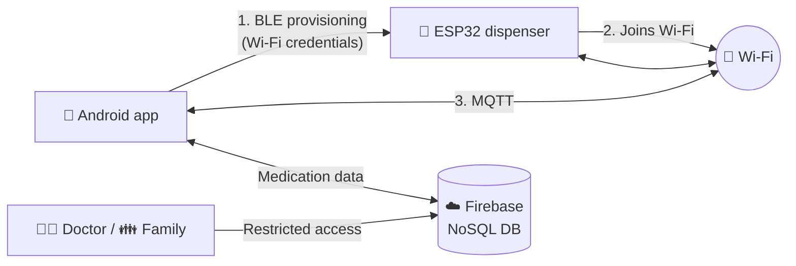

# 💊 Smart Pill Dispenser – Android App
 
Android companion app for a programmable ESP32-based pill dispenser.
Built as my final project for the Mechatronics Higher Technician program (ITLA).
 
The app **provisions the device over BLE**, talks to it over **Wi-Fi using MQTT**, and keeps the medication schedule in the cloud so **patients, doctors and family members** can follow the treatment together.
 
---
 
## ✨ Features
 
| | Feature | Description |
|---|---|---|
| 📡 | **BLE provisioning** | Find the dispenser over BLE, set up a secure session and send it the Wi-Fi credentials |
| 📶 | **Wi-Fi + MQTT** | Once provisioned, the app and the ESP32 exchange data over MQTT |
| ☁️ | **Cloud storage** | Medication data is stored in Firebase's NoSQL database |
| 🔐 | **Google sign-in** | Authentication with a Google account |
| 🪪 | **Patient ID** | Every patient gets a unique ID that links their data and devices |
| 👨‍⚕️ | **Shared access** | Restricted access for doctors and family members for joint follow-up |
| 🔔 | **Smart reminders** | Notifications at the time each medication has to be taken |
| ⏰ | **Custom alarms** | Schedules by cycles, days, hours, fortnights or months |
 
---
 
## 🧭 How it works
 

 
1. **Provision** – the app scans for the dispenser over BLE, establishes a secure session and sends the Wi-Fi network credentials.
2. **Connect** – the ESP32 joins the Wi-Fi network.
3. **Communicate** – the app and the dispenser exchange commands and status over MQTT.
4. **Follow up** – schedules and medication records live in Firebase, where doctors and family members see what their role allows.
---
 
## 🛠️ Tech stack
 
- **App:** Android (Java), Android Studio
- **Provisioning:** [esp-idf-provisioning-android](https://github.com/espressif/esp-idf-provisioning-android) by Espressif
- **Device:** ESP32
- **Messaging:** MQTT over Wi-Fi
- **Backend:** Firebase (Google authentication + NoSQL database)
---
 
## 💡 Why Java and not Flutter?
 
I started the app in Flutter, but the BLE provisioning layer I needed is provided by Espressif's examples and library in Java. Instead of porting that layer, I kept the app in native Android and built on top of it.
 
---
 
## 🚀 Getting started
 
1. Clone the repository and open it in Android Studio.
2. Add your own Firebase configuration file (`google-services.json`) to the `app/` folder.
3. Set the MQTT broker details for your setup.
4. Build and run on an Android device (BLE is required).
> ⚠️ Credentials and keys are not included in this repository.
 
---
 
## 🗺️ Roadmap
 
- [ ] OTA firmware updates for the dispenser
---
 
## 📄 Credits
 
Provisioning is built on Espressif's [esp-idf-provisioning-android](https://github.com/espressif/esp-idf-provisioning-android) library. See its repository for its license and documentation.
